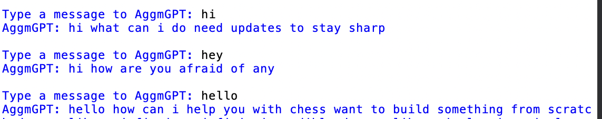
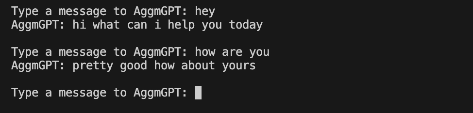

# AggmGPT

AggmGPT is a lightweight foundational AI language model developed by **Adolfo GM**, designed to generate human-like text using n-gram models combined with self-attention mechanisms. The project is licensed under the **MIT License**, making it open-source and free for modification and distribution.

## Features
- Implements **Self-Attention** and **Multi-Head Attention** for improved context understanding.
- Includes **positional encoding** to retain sequence structure.
- Features a **Feed-Forward Neural Network** to refine predictions.
- Tokenization and embedding functions for handling input text.

## Installation
Ensure you have Python installed on your system. You can download it from the [official website](https://www.python.org/downloads/).

## How It Works
AggmGPT processes text through:
1. **Tokenization & Embedding**
2. **Positional Encoding**
3. **Self-Attention & Multi-Head Attention**
4. **Feed-Forward Network**
5. **N-gram Models**

## License
This project is licensed under the **MIT License**. See the `LICENSE` file for details.

## Author
Created by **Adolfo GM**.

